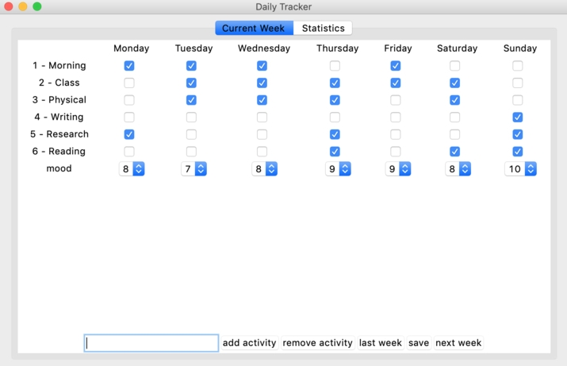
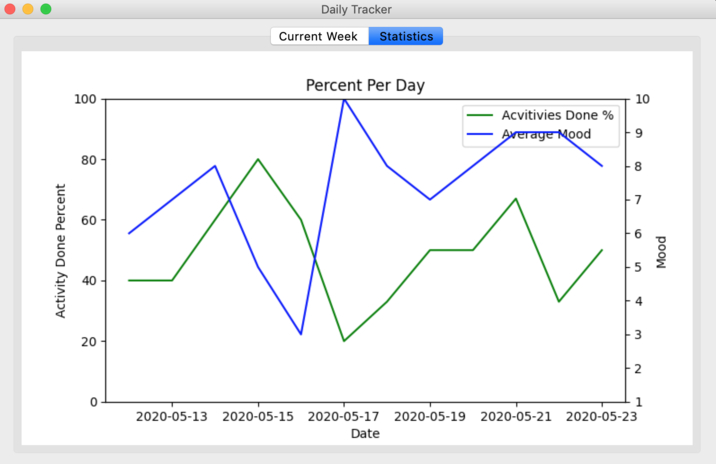

# Daily-Tracker

## Description
Application that helps you track your goals, habits and mood. A statistic tab that shows a correlation between what you have done and your overall mood with a simple and intuitive graph.

## Installation

### Requirements

* python3 & pip3
* ` git clone https://github.com/midastown/Daily-Tracker.git `
* Use ` pip3 install -r requirements.txt ` to install the required packages
* ` python3 main.py `
* Don't forget to save after each session

## Notes

### Contributions
* Me (midastown)
* [Isaac](https://github.com/IsaacA2151)

### TODO
* Adding a simple text area linked to each particular day... A diary of some sorts.
* A function that can export data to csv
* The ability to save when closing the window instead of clicking a button
* The ability to add activity with ENTER instead of dedicated button
* The ability to navigate weeks with arrows on top of dedicated buttons
